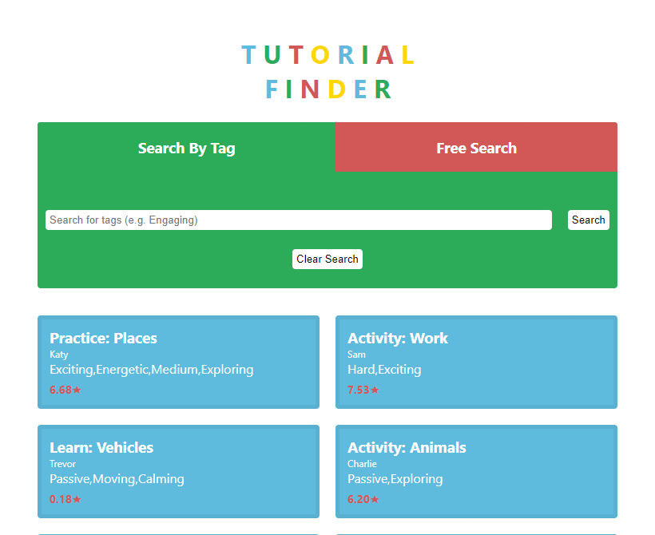

# Video Tutorial Web App

The aim of this task is to create a web or mobile app for retrieving and displaying
video tutorial information to a user.

Click this link to visit: https://jarasmar.github.io/Video-Tutorial-App/




### Acceptance Criteria

- [x] Upon load, the app downloads a list of available video tutorials, by performing a GET request to a provided API.

- [x] The app has a way for the user to refresh the video tutorials to view the most
up to date information.

- [x] Users should be able to search by tags and get the top 20 rated videos that contain any of the provided tags.

- [x] Users should be able to search by typed input and get a colection of tutorials that match the search term.

- [ ] Searching Methods should be covered with tests.

- [x] User interface should be clear and easily navigable for the end-user.


## Example of JSON Response
```
[
  {
    "id":"3fda6df9-97aa-4039-ac22-5978e6c73d5f",
    "videoUrl":"https://thisurldoesnotactuallyexist.totallynotreal/3fda6df9-97aa-4039-ac22-5978e6c73d5f",
    "videoTitle":"Practice: Places",
    "tags":["Exciting","Energetic","Medium","Exploring"],
    "teacherName":"Katy",
    "teacherId":"611601f4-7a7a-4e43-a60f-0265cd18dfce",
    "averageUserRating":0.6683530068243697
  }
]
```

## Company Color Palette
- Blue: #5FBBDD
- Green: #2CAB58
- Red: #D25858
- Yellow: #FFD700
- White: #ffffff
- Black: #000000